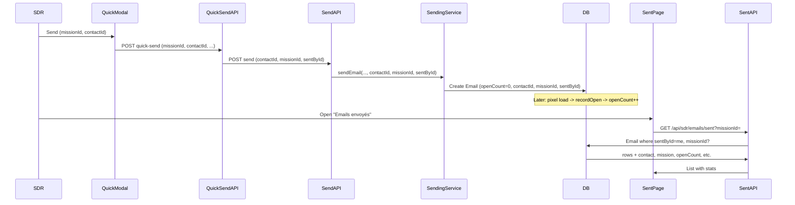

# Plan: Mission Emails Sent Page for SDRs (with open/click stats)

## 1. Goal

When SDRs send emails to contacts (via quick-send from action page, contact/company drawer, or mission context), those sends should be **findable** on a dedicated **mission emails sent** page, with **stats**: opened (count + first opened at), clicked, and basic metadata (contact, subject, mission, date).

---

## 2. Current State

| Area | Current |
|------|--------|
| **Send path** | SDR uses `QuickEmailModal` → `POST /api/email/quick-send` with `mailboxId`, `templateId`, `to`, `contactId`, `companyId`, `customSubject`, `customBodyHtml`. quick-send forwards to `POST /api/email/send` with formData: `mailboxId`, `to`, `subject`, `bodyHtml`, `bodyText`, `contactId` (optional). |
| **Send API** | `/api/email/send` does **not** read `contactId` or `missionId` from formData; it only passes to `emailSendingService.sendEmail()`: to, subject, bodyHtml, etc. |
| **Sending service** | Creates `Email` record with: mailboxId, threadId, from/to, subject, bodyHtml, trackingPixelId, openCount/clickCount/firstOpenedAt/lastOpenedAt, providerMessageId, sentAt. **No** contactId, missionId, or sentById. |
| **Email model** | Has tracking fields (openCount, clickCount, firstOpenedAt, lastOpenedAt). No link to Contact, Mission, or User (SDR). |
| **QuickEmailModal** | Receives `missionId` and `missionName` as props (from action page or drawers) but does **not** send `missionId` in the quick-send request body. |
| **SDR nav** | "Mes emails" → `/sdr/email` (inbox). No "Emails envoyés" or mission-sent view. |

So today: emails sent via quick-send are stored as generic outbound emails with tracking, but we cannot filter "emails sent by me in mission X" or "to contact Y from missions."

---

## 3. Approach

1. **Link sent emails to SDR, mission, and contact**  
   Add optional fields on the existing `Email` model: `contactId`, `missionId`, `sentById`, `templateId`. When an email is sent from the SDR/mission flow (quick-send with missionId/contactId), persist these so we can query "mission emails sent by this SDR" and show contact + mission + stats.

2. **Use existing tracking**  
   Open/click are already recorded in `Email` (tracking pixel, `recordOpen` / `recordClick`). No change to tracking; we only need to expose these on the new page.

3. **New API + page**  
   - API: `GET /api/sdr/emails/sent?missionId=...` → list emails where `sentById = current user` and optionally `missionId = ...`, with contact, mission, and tracking stats.  
   - Page: `/sdr/emails/sent` — "Emails envoyés (missions)" with mission filter and a table (or cards) showing: contact name, company, subject, mission name, sent at, opened (badge/count), clicked (badge/count), first opened at.

4. **Propagate missionId in send flow**  
   Quick-send and send API must accept and persist `missionId` and `sentById` (and keep `contactId`); sending-service must write them to the Email record.

---

## 4. Data Model Changes

**File:** [prisma/schema.prisma](prisma/schema.prisma)

On **Email** (around line 1138), add optional outreach/mission fields and relations:

- `contactId` (String?, optional) → `contact` Contact?
- `missionId` (String?, optional) → `mission` Mission?
- `sentById` (String?, optional) → `sentBy` User?
- `templateId` (String?, optional) → `template` EmailTemplate?

Add indexes: `@@index([sentById])`, `@@index([missionId])`, `@@index([contactId])` for the list query.

On **Contact**, add: `sentEmails Email[]` (emails sent to this contact in outreach context).

On **Mission**, add: `sentEmails Email[]` (emails sent in this mission’s context).

On **User**, add: `sentEmails Email[] @relation("SentEmails")` (emails sent by this user in outreach context).

On **EmailTemplate**, add: `sentEmails Email[]` (optional, for "sent with this template" analytics later).

Run migration after schema edit.

---

## 5. Send Flow Changes

### 5.1 Quick-send

**File:** [app/api/email/quick-send/route.ts](app/api/email/quick-send/route.ts)

- Read `missionId` from request body (optional).
- When calling internal `/api/email/send`, append to formData:
  - `contactId` (already sent when provided)
  - `missionId` (new)
  - `sentById` = `session.user.id` (so the send endpoint knows who sent it)
  - `templateId` (optional, from body)

### 5.2 Send API

**File:** [app/api/email/send/route.ts](app/api/email/send/route.ts)

- Read from formData: `contactId`, `missionId`, `sentById`, `templateId` (all optional).
- If `sentById` is not provided but session exists, set `sentById = session.user.id` for consistency when contactId or missionId is set.
- Pass these to `emailSendingService.sendEmail(mailboxId, { ... options, contactId, missionId, sentById, templateId })`.

### 5.3 Sending service

**File:** [lib/email/services/sending-service.ts](lib/email/services/sending-service.ts)

- Extend `SendOptions`: optional `contactId?`, `missionId?`, `sentById?`, `templateId?`.
- In `sendEmail()`, when creating the `Email` record, set:
  - `contactId: options.contactId ?? undefined`
  - `missionId: options.missionId ?? undefined`
  - `sentById: options.sentById ?? undefined`
  - `templateId: options.templateId ?? undefined`

No change to tracking or inlining logic.

---

## 6. QuickEmailModal

**File:** [components/email/QuickEmailModal.tsx](components/email/QuickEmailModal.tsx)

- In `handleSend`, when calling `POST /api/email/quick-send`, add to the JSON body:
  - `missionId: missionId ?? undefined`
  - (contactId and companyId already sent)

So when an SDR sends from the action page or a drawer with a mission context, `missionId` is stored on the Email.

---

## 7. New API: List SDR mission emails sent

**New file:** `app/api/sdr/emails/sent/route.ts`

- **GET** ` /api/sdr/emails/sent?missionId=...`
- Auth: session required, user is the SDR (or allow same roles as quick-send).
- Query: `missionId` optional; when present, filter by that mission.
- Logic:
  - Query `Email` where:
    - `direction = 'OUTBOUND'`
    - `sentById = session.user.id`
    - `missionId` is not null (only "mission" sends)
    - if `missionId` query param: `missionId = param`
  - Order by `sentAt` desc.
  - Include: `contact` (id, firstName, lastName, email, company { id, name }), `mission` (id, name), `template` (id, name), and scalar fields: subject, sentAt, openCount, clickCount, firstOpenedAt, lastOpenedAt.
- Return: `{ success: true, data: Email[] }` (with nested contact, mission, template).

Pagination (e.g. limit 50, cursor or offset) can be added later.

---

## 8. New Page: Mission emails sent

**New file:** `app/sdr/emails/sent/page.tsx`

- Client component.
- Fetch `GET /api/sdr/emails/sent` and optionally `?missionId=...` when user selects a mission filter.
- **Mission filter:** Dropdown or select "Toutes les missions" + list of missions the SDR is assigned to (from existing API e.g. `/api/sdr/missions` or from a new small endpoint that returns mission id/name for current user).
- **Table (or card list):**
  - Contact (name + company name)
  - Subject
  - Mission name
  - Sent at (formatted date/time)
  - **Opened:** badge or "Oui (N fois)" / "Non", optionally first opened at
  - **Clicked:** badge or "Oui (N fois)" / "Non"
- Optional: link to contact (e.g. `/sdr/contacts/[id]`) or to email thread if we have threadId.
- Empty state: "Aucun email envoyé en mission" when list is empty.

Reuse existing UI patterns (Card, tables, badges) from [app/manager/email/templates/page.tsx](app/manager/email/templates/page.tsx) or SDR action page.

---

## 9. Navigation

**File:** [lib/navigation/config.ts](lib/navigation/config.ts)

- Under SDR_NAV, either:
  - Add a new item: "Emails envoyés" → `/sdr/emails/sent` (icon: Send or MailCheck), permission `pages.email`, **or**
  - Keep a single "Mes emails" entry but make it a parent with children: "Boîte de réception" → `/sdr/email`, "Emails envoyés (missions)" → `/sdr/emails/sent`.

Recommendation: add a single nav item "Emails envoyés" → `/sdr/emails/sent` so SDRs see it clearly without nesting (simpler).

---

## 10. Summary Diagram

---

## 11. File Checklist

| Step | File / action |
|------|----------------|
| 1 | [prisma/schema.prisma](prisma/schema.prisma) — Add contactId, missionId, sentById, templateId to Email; add relations on Contact, Mission, User, EmailTemplate; add indexes. Run migration. |
| 2 | [app/api/email/quick-send/route.ts](app/api/email/quick-send/route.ts) — Read missionId, send contactId, missionId, sentById, templateId in formData to send API. |
| 3 | [app/api/email/send/route.ts](app/api/email/send/route.ts) — Read contactId, missionId, sentById, templateId from formData; pass to sendingService. |
| 4 | [lib/email/services/sending-service.ts](lib/email/services/sending-service.ts) — Extend SendOptions and prisma.email.create with contactId, missionId, sentById, templateId. |
| 5 | [components/email/QuickEmailModal.tsx](components/email/QuickEmailModal.tsx) — Include missionId (and templateId if not already) in quick-send body. |
| 6 | **New** `app/api/sdr/emails/sent/route.ts` — GET list with filters and includes. |
| 7 | **New** `app/sdr/emails/sent/page.tsx` — Page with mission filter and table/cards with stats. |
| 8 | [lib/navigation/config.ts](lib/navigation/config.ts) — Add "Emails envoyés" → `/sdr/emails/sent` to SDR_NAV. |

---

## 12. Optional Later

- **Pagination** on GET `/api/sdr/emails/sent` (limit/offset or cursor).
- **Export** (CSV) of sent emails with stats.
- **Per-mission summary** on the same page (e.g. "Mission X: 12 envoyés, 5 ouverts, 2 clics").
- **Link to thread** (open in "Mes emails" inbox if thread exists) from a row.
- **Template name** column if templateId is stored.

This plan reuses existing tracking and send pipeline, adds minimal schema and API surface, and gives SDRs a single place to see mission emails sent with open/click stats.
